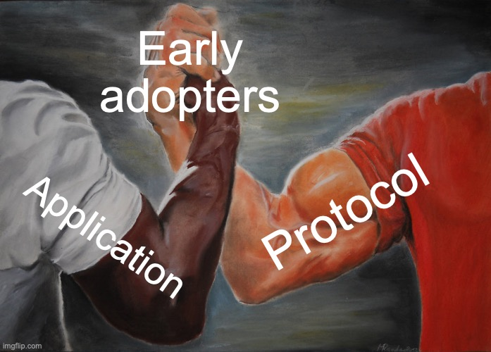

As we enter Q4 2024, the Stratum V2 Reference Implementation (SRI) project is focused on achieving key objectives that will pave the way for broader adoption in 2025. 

With a skilled and focused team of core contributors, our main goal is to **secure SRI adoption** in 2025 by supporting one or more early adopters (in addition to [Demand](https://www.dmnd.work)) in launching an SV2 Pool.

We plan to achieve this through:

- **Refining low-level APIs**: Ensuring the protocol crates are thoroughly documented and production-ready. (currently in beta)
- **Close collaboration with early adopters**: Actively working with early adopters to support their SV2 journey and ensure the project aligns with actual market needs
- **Refactoring high-level (application) roles**: Initiating refactoring efforts with the guidance and feedback of early adopters and getting roles into beta and eventually production-ready state (currently in alpha)

Our primary development objective is to **refine our APIs** through comprehensive documentation and refactoring. This is complemented by the implementation of a **new integration test framework** to ensure codebase stability and predictable component interactions.

Our secondary development goal centers around **close collaboration with early adopters**. This interaction helps us achieve two things: a better understanding of market requirements and valuable contributions from early adopters, which will accelerate the **refactoring** and **production-readiness** of the most used **roles** (applications).

Currently, a few early adopters, despite being aware of the alpha state of  the application-level roles, have begun building on these roles. Several adopters are using them with the goal of launching a beta or **production-ready SV2 Pool** in 2025. For this reason, we’re proposing to shift from our original plan to focus solely on APIs.

Getting real user feedback during development is something we’ve been waiting for a long time, and now that early adopters are engaging with SRI, it’s crucial to adapt to this reality. If we remain solely focused on refining low-level protocols while early adopters are actively building on the high-level roles, we risk creating a bottleneck that could leave early adopters waiting for months while we finalize the necessary refactoring. 

To address this, the roadmap suggests a **balanced approach**. Part of the core team will continue to prioritize low-level protocol work, but another part should actively engage with early adopters to understand their specific needs at the application level, documenting those needs and ensure the most requested features are in place. We should ideally aim to motivate early adopters to help us through direct or indirect contributions to our codebase. 

This means our team needs to be in sync, adapting to this new situation and plan out how to tackle these efforts nearly in parallel. It’s suggested that we don’t start working on roles until a new testing suite is in place. Once that is done, we should work with early adopters, getting as much feedback as we can on roles, encouraging them to contribute back to our codebase, as we work on protocols.

Below, is a high-level look at our roadmap for the next few months. This plan focuses on improving the maturity of our codebase through protocol refactoring, specification stabilization, and removing technical debt, all while keeping early adopters engaged and supported throughout the process, aiming to initiate work on roles,  always having the same mission: SRI adoption. It it's a dynamic plan, subject to change depending on early adopter interactions.

Higher-resolution image available [here](https://drive.google.com/file/d/1CWFt9o7NOFYfdJrgashLlsAagz7PBZxO/view?usp=sharing) | [Figma File](https://www.figma.com/design/JOgHHrAeRYLHjn6Hc2Hfle/SRI-Roadmap-2024%2F25?node-id=0-1&t=woeUq9LRsGTiT3Ly-1)

## October 
- SRI **1.1.0 launch.** This release includes the base for comprehensive protocol documentation, and addition of the integration tests framework.
- We are establishing regular **communication channels and dedicated support** for all potential adopters and the core team. This involves organizing calls and support channels to ensure a smooth adoption process.
- A dedicated [auditor role](https://github.com/stratum-mining/stratum/discussions/1052) working group is being established to explore the specifics of the auditor role. This role will focus on transparency and accountability of shares, addressing the need for better auditing processes in mining operations.
- Cleaning up the **Mining Protocol Specs** [#98](https://github.com/stratum-mining/sv2-spec/pull/98)

## December

- Add variable difficulty feature to the pool
- Launch SRI 1.2.0 - ensures protocol crates are all well documented and finalized and integration tests framework together with tests is in place, basically unifying the efforts that started in the past 2-3 months.
- Begin estimation on refactoring and improvements for protocols
- Continue our Auditor Role research alongside the development efforts. 
- Benchmarking Case Study launched by an adopter, showcasing the advantages of SV2 in a real-world scenario. This case study will serve as a proof point to illustrate SV2’s benefits to other potential adopters.
-Encouraging early adopters to contribute back to SRI to avoid code fragmentation and ensure easier maintenance long-term (these contributions will most likely be in roles)
 
## January
- During this period, we are also focusing on **migrating the Message Generator** (MG) to a separate repository to better modularize the codebase.
- Continue our **Auditor Role research** alongside the development efforts. 
Simultaneously, we should kick off early firmware research inspired by [this doc](https://docs.google.com/document/u/1/d/1iW48-Y4Xvr2IN7PU_9xYw-i5wReCQ98SyliI55_LSos/edit). 

## February-March
- One of our key objectives is to see an **early adopter deploy SV2** in their production environment. 
- **Auditor Role Specification proposal** based on the research conducted in Q4 2024.
- **1.3.0 Launch** is scheduled for March, which should also finalize our protocol level refactorings.
- Migrating Message generator out of the main repository.

## Future 

Moving forward, our goal is to work towards beta and eventually **production-ready applications** by refining and solidifying all critical components, ensuring the protocol is battle tested for widespread adoption.
